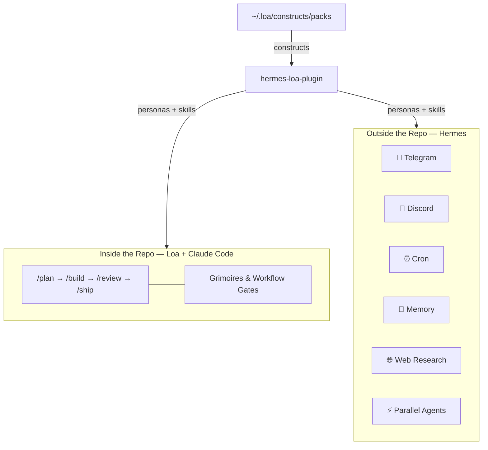
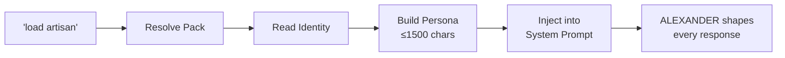
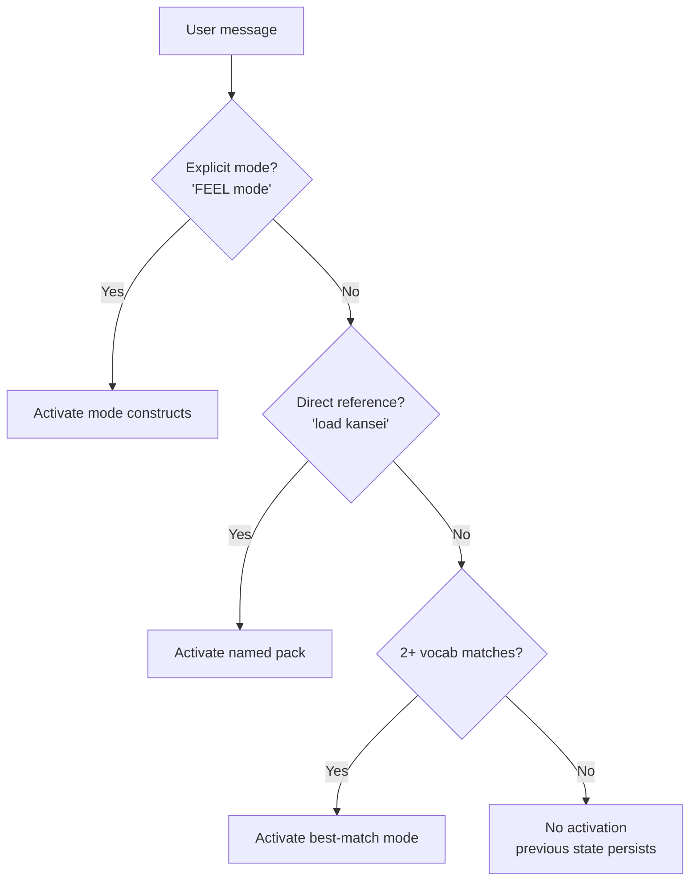
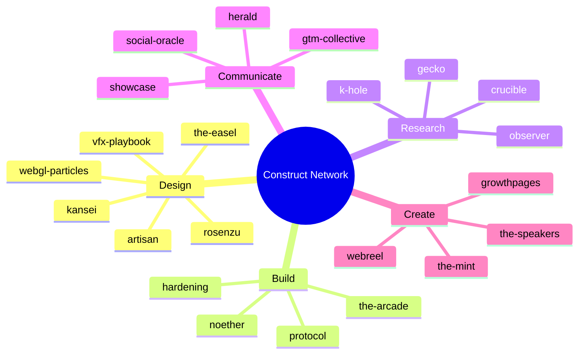
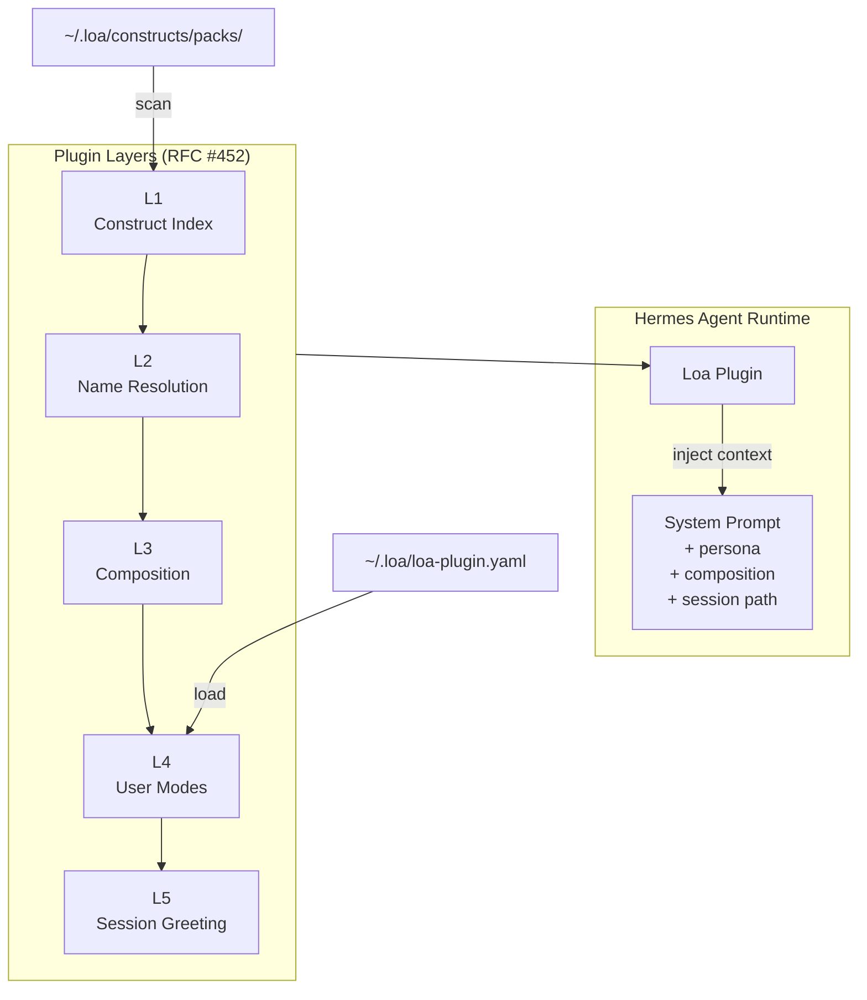
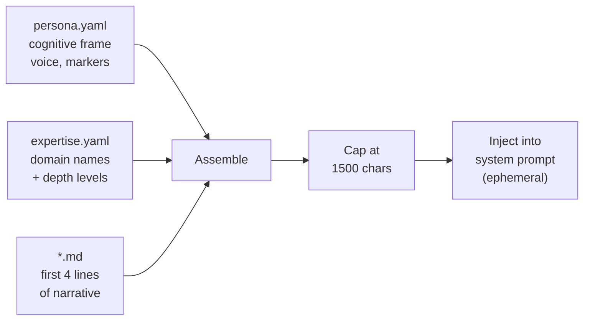
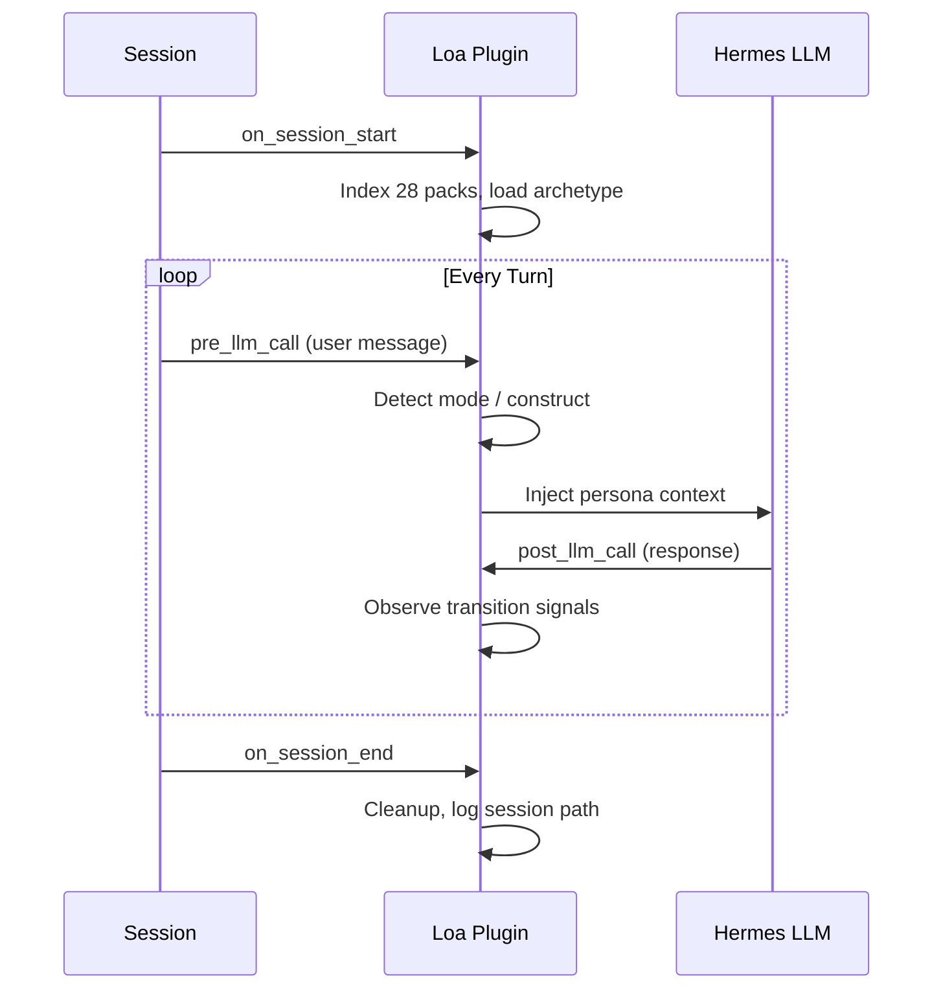

# hermes-loa-plugin

Hermes is the harness. Loa constructs are the horse.

> "The framework's job is not to build tools for other people. It's to build structure that helps people do deeper work for themselves and better learn how they work."
>
> ```
> present options → honor the choice → step aside → be there when called
> ```

This plugin puts your [Loa](https://github.com/0xHoneyJar/loa) construct network inside the [Hermes](https://github.com/hermes-ai/hermes-agent) agent runtime — which means your constructs travel with you. CLI, Telegram, Discord, Slack. Scheduled on cron. With memory across sessions. With web research and parallel delegation.

Loa runs inside the repo. This takes the constructs outside of it.



## Install

```bash
# One line. Constructs must already be at ~/.loa/constructs/packs/
git clone https://github.com/0xHoneyJar/hermes-loa-plugin ~/.hermes/plugins/loa
```

Verify:

```bash
hermes plugins list
# loa | enabled | 1.1.0
```

That's it. No config required. Start a Hermes session and talk to your constructs.

## Use

### Load a construct

```
> load artisan
```



The plugin finds artisan in your packs, reads its identity, and injects the persona into context:

```
[Loa: ALEXANDER]
Construct: ALEXANDER
Archetype: sensory architect
Disposition: precision through material honesty
Tone: direct, warm-technical
Expertise: Design Systems (L5), Motion Design (L5), Typography (L4)
[ALEXANDER]: Every pixel carries weight. I don't decorate — I tune.
The difference between 'this feels right' and 'this feels off' is
usually 2px, 40ms, or one wrong easing curve.
```

That context shapes every response for the session until you switch.

```
> load kansei
> use observer
> activate k-hole
```

All work the same way. The plugin resolves the pack, loads the persona, and activates any `compose_with` partners automatically.

### Define your own modes (optional)

If you want named modes — ways of working that compose multiple constructs — create a config:

```bash
cp ~/.hermes/plugins/loa/examples/operator-os-v2.yaml ~/.loa/loa-plugin.yaml
```

Then:

```
> FEEL mode
  → artisan + ALEXANDER activated

> DIG mode
  → k-hole + STAMETS activated
```

Modes are yours to define. The plugin ships with zero defaults. Three example archetypes are included:

| Example | Style | Modes |
|---------|-------|-------|
| `operator-os-v2.yaml` | Six cognitive modes | FEEL, ARCH, DIG, SHIP, FRAME, TEND |
| `product-builder.yaml` | Build / learn / tell cycle | BUILD, LEARN, TELL |
| `dagger-focus.yaml` | Single focus, no switching | None — direct activation only |

Or write your own:

```yaml
# ~/.loa/loa-plugin.yaml
modes:
  dig:
    constructs: [k-hole]
    persona: STAMETS
    vocab: [research, explore, deep dive, investigate]
  build:
    constructs: [the-arcade, artisan]
    persona: OSTROM
    vocab: [implement, build, sprint, feature, ship]
```

If your mode defines `vocab`, the plugin detects domain language implicitly (2+ matches required to avoid false positives).

No config file? No modes. Direct activation always works regardless.

### How activation resolves

When you send a message, the plugin decides what to activate:



Explicit always wins. Direct reference is second. Implicit vocab is the power-user layer.

## What You Get

When this plugin indexes your packs, every skill in every construct becomes available to Hermes. **259 skills across 28 packs:**



All dynamically discovered from whatever you have installed. Install a new pack, start a new session, it's indexed.

<details>
<summary>Full pack reference table</summary>

| Pack | Domain | Skills |
|------|--------|--------|
| **artisan** | Visual/sensory design | styling-material, animating-motion, crafting-physics, synthesizing-taste, ... |
| **k-hole** | Deep research | dig, deep-research, domain-discovery, orchestrator |
| **observer** | User observation | observing-users, detecting-drift, daily-synthesis, shaping-journeys, ... |
| **noether** | Smart contracts | forge, ceremony, evolve, audit-contract, excavate |
| **protocol** | On-chain integration | abi-audit, contract-verify, simulate-flow, tx-forensics, ... |
| **hardening** | Security | audit-auth, audit-api, blast-radius, triage, postmortem, ... |
| **kansei** | Perceptual engineering | crafting-shaders, material-physics, timing-rituals, tuning-springs |
| **the-arcade** | Game systems | designing-systems, prototyping-mechanics, crafting-feel, ... |
| **gtm-collective** | Go-to-market | positioning-product, analyzing-market, pricing-strategist, ... |
| **herald** | Communications | chronicling-changes, grounding-announcements, synthesizing-voice |
| **showcase** | Visual storytelling | storytelling-layout, visual-semiotics, data-encoding, ... |
| **social-oracle** | Social content | generate-x, generate-discord, generate-telegram |
| **gecko** | Ecosystem health | observe, patrol, diagnose, report |
| **rosenzu** | Spatial awareness | mapping-topology, designing-thresholds, naming-rooms, ... |
| **webgl-particles** | WebGL/3D | particle-orchestrator, procedural-shaders, gpu-architecture, ... |
| **beacon** | Content/SEO | generating-markdown, optimizing-chunks, auditing-content, ... |
| **the-easel** | Visual exploration | exploring-visuals, grounding-creative, recording-taste |
| **the-mint** | Token/NFT systems | mint, materialize, character, environment, animate, ... |
| **the-speakers** | Audio/sonic | making-beats, scoring-experience, suno-prompt, capturing-audio, ... |
| **crucible** | QA/testing | validating-journeys, walking-through, diagramming-states |
| **growthpages** | Landing pages | generate, research, edit, configure-project |
| **vfx-playbook** | Visual effects | apply, review, playbook, research |
| **webreel** | Video capture | capture, encoder, preview, configure |
| **dynamic-auth** | Wallet/identity | resolving-wallet-identity, enforcing-primary-wallet |
| **mibera-codex** | Lore/worldbuilding | browse-codex, query-entity, cross-reference |
| **vocabulary-bank** | Design vocabulary | synthesizing-vocabulary, auditing-vocabulary |

</details>

## What Hermes Adds to Constructs

Loa gives your constructs depth inside the repo — golden paths, workflow gates, grimoires. Hermes gives them reach outside of it:

| Capability | What It Means for Constructs |
|------------|------------------------------|
| **Multi-platform** | Talk to ALEXANDER from Telegram. Get KEEPER reports in Discord. Run DIG from your phone. |
| **Cross-session memory** | Hermes remembers. Observations accumulate. Context from last week's TEND sweep is searchable today. |
| **Scheduled runs** | Cron a weekly TEND patrol that reports drift to your Discord channel. Schedule DIG research overnight. |
| **Parallel delegation** | Spawn three agents: one auditing security, one checking drift, one researching competitors. Results return together. |
| **Web research** | k-hole's research skills gain live web search, page extraction, and academic paper access. |
| **Session search** | "What did we decide about the auth migration?" — searches all past sessions, not just the current context. |

## Architecture

Based on [RFC #452: First-Class Construct Support in Loa](https://github.com/0xHoneyJar/loa/issues/452).



| Layer | From RFC #452 | Plugin Implementation |
|-------|---------------|----------------------|
| **L1** | Construct Index | Scans `~/.loa/constructs/packs/`, builds domain + keyword indices |
| **L2** | Name Resolution | Three priorities: explicit mode → direct construct → implicit vocab |
| **L3** | Composition as Pipe | `compose_with` from `construct.yaml` auto-injects partner context |
| **L4** | Personal Operator OS | User-defined modes from `loa-plugin.yaml` — your modes, your rules |
| **L5** | Ambient Presence | Session greeting: pack count, available modes, active constructs |

### How persona injection works

The plugin reads up to three identity files per pack and assembles a compact summary:



Scalar fields only — never dumps raw YAML into the prompt. The result is ephemeral: appended for one turn, never persisted to session history.

### Hook lifecycle



## Extending

### Custom context injection

The `_load_extensions()` function in `__init__.py` is an open hook. Return a string to inject additional context per turn:

```python
def _load_extensions(state, user_message):
    if "deploy" in user_message.lower():
        return "[Deploy target: production-us-east-1]"
    return None
```

See `examples/hivemind_extension.py` for a full organizational memory pattern — detects questions like "what products do we have?" and auto-injects knowledge files from a dedicated pack.

### Adding packs

```bash
cd ~/.loa/constructs/packs
gh repo clone 0xHoneyJar/construct-<name> <name> -- --depth 1

# Plugin auto-indexes on next session start
```

### Writing a new pack

A pack needs `construct.yaml` at minimum. See the [Loa Constructs](https://github.com/0xHoneyJar/loa-constructs) repo for the full schema. The plugin indexes any pack that has:

```
construct.yaml              # required
identity/persona.yaml       # optional — cognitive frame, voice
identity/expertise.yaml     # optional — domain specializations
identity/*.md               # optional — persona narrative
skills/<name>/SKILL.md      # optional — Hermes-discoverable skills
```

## Notes

- **Persona budget**: Identity injection is capped at 1500 chars. Extracts scalar fields only from YAML — never dumps raw nested structures into the prompt.
- **Mixed types**: `skills` and `compose_with` in `construct.yaml` can be dicts or strings. The plugin handles both.
- **Implicit detection threshold**: 2+ vocabulary matches required. Explicit "X mode" always wins.
- **State lifecycle**: Session state lives in memory. Hermes restart resets mode — users re-invoke naturally.
- **Skills cache**: Hermes caches the skill index. After changing SKILL.md files, restart or wait for mtime invalidation.
- **Slash commands**: Loa `commands/` directories are for Claude Code only. Hermes discovers skills via `SKILL.md`, not slash commands. The 259 skills are fully available; the 93 slash commands are not.

## License

AGPL-3.0 — same as [Loa](https://github.com/0xHoneyJar/loa).
